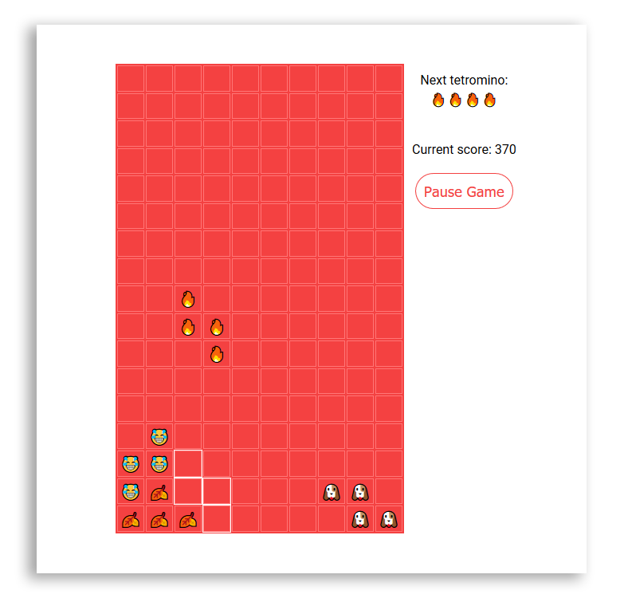
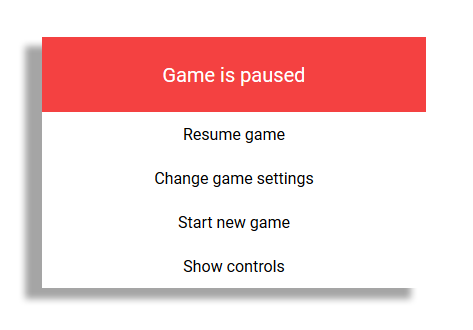

# emorjis [](https://travis-ci.org/Knutakir/emorjis) [](https://david-dm.org/knutakir/emorjis)
Emoji Tetris 😎 made with javascript

All game files are found in [src](src).

## Installation
Fork this repository or download
with: ```git clone https://github.com/Knutakir/emorjis```

Then run ```npm start```.

Or if you dont want
an express server for the game, then navigate to the ***src***
folder and run [index.html](src/index.html) in your webbrowser.

## Screenshot


### Menu


### Game over


## Controls
* <kbd>←</kbd> to navigate left and <kbd>→</kbd> to navigate right.
* <kbd>↑</kbd> to rotate the tetromino clockwise.
* <kbd>↓</kbd> to move tetromino faster.
* <kbd>Space</kbd> to drop the tetromino all the way down.
* <kbd>Escape</kbd> to pause the game and view a menu.

## Score system
In emorjis you get score from:
* Letting a tetromino drop all the way down, you only get a score of 10 with this.
* Move a tetromino all the way down(triggered by pressing <kbd>Space</kbd>),
you get a score based of how high you are in the game board. You get a score of number of rows
in the table to move down multiplied with 10.
  * Example: move 7 rows down: 7 * 10 = 70
* Clear rows. You get 100 base score multiplied with number of rows cleared powered.
  * Example: 2 rows cleared = 100 * (2^(2)) = 400

## Documentation
See [src/README.md](src/README.md) for a explenation of some of the code.

## Licence
MIT © Knut Kirkhorn
