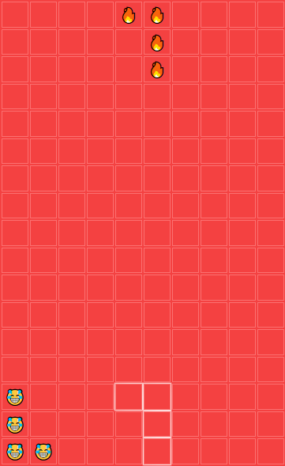

# emorjis
Emoji Tetris 😎 made with javascript

All game files are found in [src](src).

## Screenshot

A little preview image of emorjis

## Controls
* <kbd>←</kbd> to navigate left and <kbd>→</kbd> to navigate right.
* <kbd>↑</kbd> to rotate the tetromino clockwise.
* <kbd>↓</kbd> to move tetromino faster.
* <kbd>Space</kbd> to drop the tetromino all the way down.

## Documentation
See [src/README.md](src/README.md) for a explenation of some of the code.

## Licence
MIT © Knut Kirkhorn
